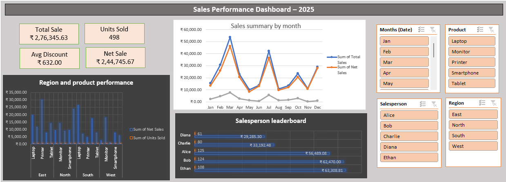

# Sales Report Dashboard – Excel Project

## 📊 Project Overview
This project demonstrates how to build a professional **Sales Report Dashboard** in Excel using real-world concepts:
- Data cleaning
- Formulas & text functions
- Conditional formatting
- Pivot tables & charts
- Lookup functions
- Data validation
- Dashboard creation

The goal is to provide actionable insights into sales performance by region, product, and salesperson.

---

## 🏢 Business Requirements
- **Audience:** Sales managers and regional leads
- **KPIs:**
  - Total Sales
  - Net Sales
  - Units Sold
  - Average Discount %
  - Top 5 Products by Net Sales
  - Salesperson Leaderboard
- **Filters:** Date (Month/Year), Region, Product, Salesperson
- **Key Questions:**
  - Which regions and products drive the most revenue?
  - How do discounts impact net sales?
  - Who are the top-performing salespeople?

---

## 🧹 Data Preparation
- Converted raw data into an Excel Table (`Sales_Table`)
- Cleaned text fields 
- Recalculated totals:
  - `Total Sales = Units Sold * Unit Price`
  - `Net Sales = Total Sales - Discount`
  - `Discount % = Discount / Total Sales`
- Applied **conditional formatting** to highlight high discounts (>20%)

---

## 📈 Pivot Tables & Charts
- **Monthly Sales Summary:** Line chart showing Net Sales trend
- **Region & Product Performance:** Clustered column chart
- **Salesperson Leaderboard:** Bar chart 

---

## 📊 Dashboard Features
- KPI cards for quick insights
- Interactive slicers (Month, Region, Product, Salesperson)
- Clean layout with consistent formatting

---

## 🔍 Insights
- Laptop has the highest net sales across South region
- Discounts above 20% significantly reduced
- Ethan and Bob consistently lead in net sales across multiple regions

---

## 🗂 Repository Structure

-data: sales_report_dashboard_data_set.csv        
-excel: sales_report_dashboard.xlsx                   
-img: sales_dashboard.png                 

---

## 📸 Screenshots

---

## 🚀 How to Use
1. Download the dataset (`sales_report_dashboard_data_set.csv`)
2. Open the Excel workbook(sales_report_dashboard)
3. Explore the dashboard with slicers and charts

---

## ✨ Tools & Skills Demonstrated
- Excel Tables
- Data Cleaning
- Formulas (SUM,AVERAGE)
- Pivot Tables & Charts
- Conditional Formatting
- Dashboard Design

---

## 📌 Author
**Rose** – Data Analyst in progress, passionate about Excel, Power BI, and Python.  
Connect with me on [LinkedIn](https://www.linkedin.com/in/rose-ut-a94b1a27b).



